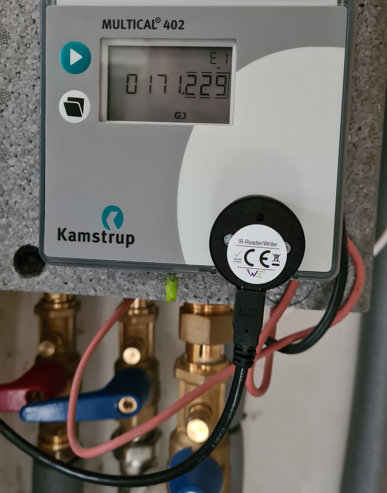

# Kamstrup multical 402 MQTT library
This project provides a Python library that enables communication with the Kamstrup Multical 402 heat meter. The configured parameters will be read from the meter at a certain interval and published in MQTT messages. This guide uses Linux as a base operating system.

# Contents
- [Kamstrup multical 402 MQTT library](#kamstrup-multical-402-mqtt-library)
- [Contents](#contents)
  - [Requirements](#requirements)
  - [Configuration file](#configuration-file)
    - [Kamstrup meter parameters](#kamstrup-meter-parameters)
  - [Running the script](#running-the-script)
    - [Running on the commandline](#running-on-the-commandline)
    - [Running as a systemd service](#running-as-a-systemd-service)
    - [Running as a Docker container](#running-as-a-docker-container)
      - [Requirements](#requirements-1)
      - [Building the image](#building-the-image)
      - [Initial start of container](#initial-start-of-container)
      - [Container management](#container-management)
  - [Meter setup](#meter-setup)
  - [Troubleshooting](#troubleshooting)
    - [Read the log file](#read-the-log-file)
    - [Reading values](#reading-values)
    - [Finding the correct com port](#finding-the-correct-com-port)

## Requirements
The following software and packages are required to run the script via the commandline or as a service
* [Python 3](https://www.python.org/downloads/)
  * [Pyserial](https://pypi.org/project/pyserial/)
  * [Paho MQTT](https://pypi.org/project/paho-mqtt/)
  * [PyYaml](https://pypi.org/project/PyYAML/)
* MQTT broker e.g.: [Mosquitto](https://mosquitto.org/)
* See [Docker requirements](#requirements-1) to run the project as a docker container.

Required hardware
* Infrared read/write USB cable e.g.: [IR Schreib/Lesekopf USB (Optokopf)](https://shop.weidmann-elektronik.de/index.php?page=product&info=24) or something simulair.

## Configuration file
The library can be configured to fit your needs using the config.yaml file. The parameters of this file are described below.
| parameter name | description |
| - | - |
| host | MQTT broker host domain name or IP address |
| port | MQTT broker port number |
| client | Client name to identify this MQTT client e.g. Kamstrup |
| topic | MQTT topic where the values are published on |
| retain | If set to true, the message will be set as the "last known good"/retained message for the topic |
| qos | The quality of service level to use for the message. Cane be any value between 0 and 2 |
| authentication | Set this to true if your MQTT broker requires authentication |
| username | Username to connect to broker |
| password | Password to connect to broker | 
| com_port | port of serial communication device |
| parameters | List of parameters that are read and published to the configured MQTT topic. See [Meter parameters](#Kamstrup-meter-parameters) table. |
| poll_interval | Meter readout interval in minutes (value should be less than 30 to prevent the meter from going in standby mode|

### Kamstrup meter parameters
These parameters can be added to the config.yaml file. Atleast one parameter must be present in the configuration file.
| parameter name | description |
| - | - |
| energy | consumed energy in GJ |
| power |   | 
| temp1 | incoming temperature in degrees |  
| temp2 | outgoing temperature in degrees| 
| tempdiff | difference between temp1 and temp2 in degrees |  
| flow | water flow in l/h |
| volume | consumed water in m3 |      
| minflow_m | minimum water flow |
| maxflow_m | minimum water flow  |
| minflowDate_m | |
| maxflowDate_m | |
| minpower_m | |
| maxpower_m | |
| avgtemp1_m | |
| avgtemp2_m | |
| minpowerdate_m | |
| maxpowerdate_m | |
| minflow_y | |
| maxflow_y | |
| minflowdate_y | |
| maxflowdate_y | |
| minpower_y | |
| maxpower_y |  |
| avgtemp1_y |  |
| avgtemp2_y |  |
| minpowerdate_y | |
| maxpowerdate_y | |
| temp1xm3 | |
| temp2xm3 |   | 
| infoevent |   |
| hourcounter | |

## Running the script

### Running on the commandline
The script can be started by simply starting the daemon file with Python 3.
``` bash
python3 daemon.py &
```
The & will start the Python script as a daemon process. 
The following output is a example of what to expect in the log file when the meter is receiving actual data from the meter.
``` bash
mqtt_handler.py publish:  46 - INFO - Publishing 'kamstrup/values' '{"energy": 227.445, "volume": 2131.935, "temp1": 52.81, "temp2": 39.94}' to 10.0.0.210:1883]
```
By subscribing to the configured mqtt topic on the MQTT broker we can view these messages. You can use [MQTT Explorer](https://mqtt-explorer.com/) for debugging to test the MQTT part.


### Running as a systemd service
Edit the kamstrup_meter.service file and adjust the path accordingly. The working directory in this example is /opt/kamstrup/.
``` bash kamstrup_meter.service
[Unit]
Description=Kamstrup2mqtt Service
After=multi-user.target

[Service]
Type=simple
WorkingDirectory=/opt/kamstrup
ExecStart=/usr/bin/python3 /opt/kamstrup/daemon.py
StandardOutput=null
StandardError=journal
Restart=always

[Install]
WantedBy=multi-user.target
```
Check if the service has the required permissions after copying, if not, change it with chmod and chown.
``` bash
cp /opt/kamstrup/kamstrup_meter.service /etc/systemd/system/
sudo systemctl daemon-reload
sudo systemctl enable kamstrup_meter.service
sudo service kamstrup_meter start
```

### Running as a Docker container

#### Requirements
Make sure the following is installed: 
* [docker](https://docs.docker.com/get-docker/)
* [docker-compose**](https://docs.docker.com/compose/)

**Docker-compose is optional but useful and easy to configure.

#### Building the image
Build a docker image "kamstrup"
``` bash
docker build -t kamstrup .
```
Edit the docker-compose.yml file and adjust the "devices" parameter accordingly. Syntax is:
``` bash
<Path must match usb device --> /dev/ttyKamstrup:/dev/ttyKamstrup <-- Inside container, must match path of config.yml>
```

#### Initial start of container
Initial start of the container:
``` bash
docker-compose up -d
```
The container should run now and produce output via Mqtt. If not, check the logging in logs.

#### Container management
After the initial start of the container it can be stopped and started again with the folowing commands:
``` bash
docker start kamstrup_kamstrup_1
docker stop kamstrup_kamstrup_1
docker restart kamstrup_kamstrup_1
```
Check if the container is running  with:
``` bash
docker stats
```

## Meter setup
It can be hard to find the correct position of the meter head. It might differ if you are using an other model. I positioned the infrared head as follows:



## Troubleshooting
This section includes some tips to solve some issues.

### Read the log file
The log file will, in most cases, spoil what going on if something's not working. 
``` bash
tail -f debug.log
```
### Reading values
If you have any troubles with retrieving the values from the meter, make sure that the meter is 'awake', you can do so by pressing any button on the meter. It is also important that you've positioned the meter head correctly. I may take a while to find the sweet spot. For some reason the position for the meter head that I've got is a little bit higher than what the distance keepers on the meter suggest.

### Finding the correct com port
Unplug the usb connector from the computer and plug it back in. Use dmesg to find the com port.
``` bash
dmesg
```
